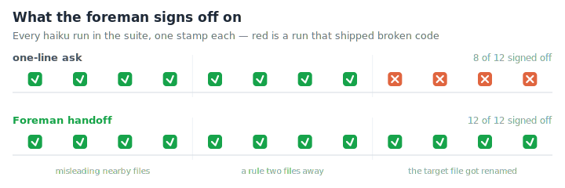
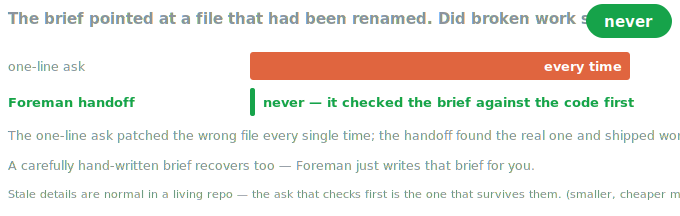
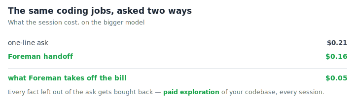
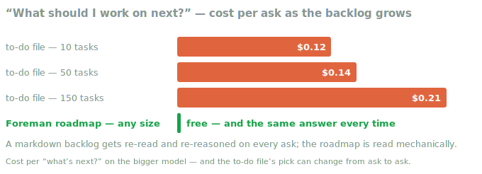

<div align="center">
  <picture>
    <source media="(prefers-color-scheme: dark)" srcset="assets/logo-dark.svg" />
    
  </picture>
  <h1>Foreman</h1>
  <p><strong>Every Claude Code session forgets everything when it ends. Foreman is what's waiting when the next one wakes up.</strong></p>

  

  <p><em>This is what passes inspection.</em></p>
</div>

<p align="center">
    <a href="https://github.com/V-Songbird/foreman/stargazers"></a>
    <a href="https://github.com/V-Songbird/foreman/blob/main/LICENSE"></a>
    <a href="https://docs.anthropic.com/en/docs/claude-code"></a>
</p>

> **TL;DR** — Every Claude Code session starts with amnesia. Foreman keeps the plan in your repo, committed like code: ask "what's next?" and you get the best task with a ready-to-run prompt, checked against the actual codebase — about a quarter cheaper per session than a bare one-line ask.

---

## What is this?

Close the laptop and every plan that only lived in your head closes with it. Open Claude Code tomorrow and it starts from zero — no memory of what you were building, what you already ruled out, or that the file it's about to edit got renamed yesterday.

Foreman keeps the plan where the code lives: a plain-language roadmap, committed like any other file. Ask "what's next?" and it hands back the best task and a ready-to-run prompt, built from what's actually true about your project right now. It earns its keep on real engineering work — the kind that outlives a single chat window.

## Why you'd want it

- **Your plan survives you forgetting it.** The roadmap lives in your repo, committed like code — the next session picks up exactly where you left off, not from a shrug.
- **You don't have to be good at prompting.** Every handoff prompt comes from the same template, guardrails built in — say what you want in plain language, Foreman does the rest.
- **It updates itself.** After each commit, Foreman checks what got finished and marks it. Opt in, and it also flags new work the commit uncovered.
- **Nothing moves without you.** No task gets added, changed, or checked off behind your back, and a project you haven't set up stays untouched.

## How it works

| Moment | What happens |
| --- | --- |
| You ask "what's next?" | Foreman weighs the roadmap — dependencies, collisions, what's done — and hands back the best task with a ready-to-run prompt |
| You describe new work | It becomes a roadmap entry, once you approve it |
| You commit | Finished tasks get checked off; opt in and new work the commit uncovered gets flagged too |
| You suspect the plan has drifted | The top tasks get double-checked against the actual code, and the roadmap corrected |

Hand a task off as tracked work and every finished piece lands as its own commit on a `foreman/<slug>` branch. Done work stays done. At the end you pick what happens to it: squash, merge, PR, or keep.

## Install

Inside Claude Code, run:

```
/plugin marketplace add V-Songbird/foundry
/plugin install foreman@foundry
```

Then, in each project you want a roadmap for, run `/foreman:init` once — it asks a few questions and builds the roadmap for you. That's the whole setup.

Running [razor](https://github.com/V-Songbird/razor) and [hush](https://github.com/V-Songbird/hush) too? Good instinct — razor keeps the code lean, hush keeps it quiet, Foreman writes the prompts.

## What you can do

You talk to Foreman in plain language. Touching the roadmap file by hand defeats the point, so don't.

| You want to… | Command |
| --- | --- |
| Set up a roadmap for a project (one-time) | `/foreman:init` |
| Pick the next task, add one, or check status | `/foreman:roadmap` |
| Build a handoff prompt for a specific task | `/foreman:craft-prompt` |
| Double-check the top tasks against your actual code | `/foreman:survey` |

## Why-notes that find you later

Git remembers every diff. Nobody remembers *why*. Turn this on and any task that makes a real call writes a short note — the choice, the options that lost, what it commits you to — tagged into the code it governs. Open that code six months later and Foreman hands you the note before you undo a decision you didn't know was there. It's off until you ask for it, since it writes files into your repo and comments into your source. The whole feature fits on one page: [`decision-log.md`](decision-log.md).

Seeing `Foreman: 019` at the bottom of your commits? Different thing, always on. A finished task closes in the same commit as the code it changed, so the commit names the task instead of the roadmap chasing a SHA that doesn't exist yet — one commit, no second "update the roadmap" commit cluttering your history. Same page covers it.

## Benchmarks

We measured what a good handoff is actually worth: the same real coding jobs, run as full agent sessions, started four ways — from a bare one-line ask up to a Foreman handoff — with the real bill read straight from the API.

<p align="center"></p>

**When the brief goes stale, the one-line ask ships broken work.** Every living repo accumulates stale detail — a file gets renamed, a note outlives the code it described. We planted exactly that trap. On the smaller model the one-line ask patched the wrong file every single time; the Foreman handoff checks the brief against the code first, found the real file, and finished the job — every single time.

<p align="center"></p>

**Skipping the brief doesn't skip the cost.** Every fact you leave out of the ask, the session buys back by exploring your codebase at your expense. On the bigger model the one-line ask cost about a third more than the Foreman handoff for the same jobs — the shortest prompt was the most expensive session.

<p align="center"></p>

**"What's next?" is free, every time you ask.** Keep your backlog in a plain to-do file and Claude re-reads the whole thing on every ask — the bill grows with the list, and the pick can change with the model's mood. Foreman reads the roadmap mechanically: instant, free at any size, same answer every time.

> [!NOTE]
> A carefully hand-written brief performs like a Foreman handoff — the difference is you don't have to write it, and the guardrails come along for free. On a strong model with a fresh, accurate brief, the rescue above simply isn't needed: stale and thin briefs are where it pays.

*How we tested: same jobs, four ways of asking, several runs each in fresh throwaway workspaces — a full multi-turn agent session every time, never a single generated reply — costs read from the API, not estimated. Numbers move a few percent between runs. Reproduce it yourself — see [benchmarks/](benchmarks/).*

## Under the hood

The roadmap is a plain file in your repo (field-by-field details in [`roadmap-schema.md`](roadmap-schema.md)), and every prompt Foreman assembles is script-checked before it ships — a malformed handoff never reaches a session. Pairs naturally with [razor](https://github.com/V-Songbird/razor) and [hush](https://github.com/V-Songbird/hush): razor cuts the code, hush cuts the noise, Foreman writes the prompts — and measured together, the three add no overhead to each other.

## Settings

Most people never touch these — `/foreman:init` asks about the common ones and writes `.foreman/config.json` for you. The full set, if you ever want them by hand:

| Setting | What it does |
| --- | --- |
| `discoverySuggestions` | After each commit, offer new roadmap entries Claude spotted in the work. On by default; set `false` to silence it. |
| `usePersona` | Whether handoff prompts open with a "You are a…" role sentence (default `true`), or plain domain framing. |
| `omitSections` | Prompt sections to leave out entirely (`tone`, `example`, `background`, `output_format`). Default none. |
| `customSections` | Extra sections to add to crafted prompts, each `{tag, content}` rendered as an inline `<tag>` block. Tags reserved by the template are rejected. Default none. |
| `requireVerification` | Hold off marking a task done after a commit until you confirm it's verified. Default `false`. |
| `taskCloseGate` | When a tracked task finishes with its roadmap entry still open: `off` (default) says nothing, `block` holds the completion until you close the entry. |
| `decisionLog` | The why-notes above: `{enabled, dir, gate}`. `enabled` is `false` by default — nothing is written until you set it `true`. Full details in [`decision-log.md`](decision-log.md). |
| `checkpoints` | How task-split runs save their work. Optional keys set the base branch, whether to use a `foreman/<slug>` branch, whether to push each commit, and what to do at the end — `squash`, `merge`, `pr`, or `keep`. Default: ask you. |
| `targetModel` | How much detail a prompt spells out, tuned to the model that runs it — smaller models get more scaffolding, bigger ones less. Default `inherit` keeps a standard level and suggests a model per task; set a concrete value to pin one. |
| `fableEnabled` | Whether this project can run Fable 5 (Max plan or API only). Asked once during `/foreman:init`; `true` makes `Fable` a selectable model alongside Haiku/Sonnet/Opus. Default `false`. |

Running with razor and hush? The recommended shape is:

```json
{
  "usePersona": false,
  "omitSections": ["tone", "output_format"]
}
```

razor already gives the session its persona and hush already owns the voice, so Foreman's prompts stay out of both lanes. Prompts handed to a background agent keep Foreman's minimal default tone even when `tone` is omitted — output styles don't reach those sessions, so nothing else would own the voice there.

> [!NOTE]
> Foreman never detects which plugins you run — this file is you declaring the shape you want, and it works the same for any third-party style plugin.

## License

MIT — see [LICENSE](./LICENSE).
