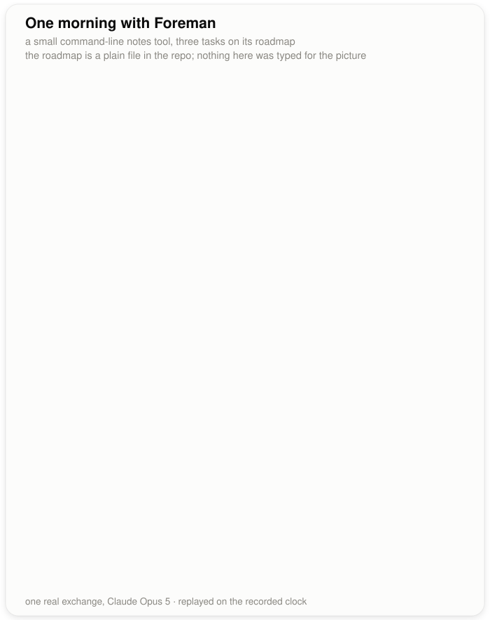

  <picture>
    <source media="(prefers-color-scheme: dark)" srcset="assets/banner-dark.png" />
    
  </picture>
  <h1>Foreman</h1>
  
<strong>Your plan stays next to your code. The next task arrives with its context checked.</strong>

**Choose your edition: [Claude Code](https://github.com/V-Songbird/foreman/tree/Claude) · [Codex](https://github.com/V-Songbird/foreman/tree/Codex)**

[**Get started**](#get-started) · [What is this?](#what-is-this) · [How it works](#how-it-works) · [What you can do](#what-you-can-do) · [Evidence](#evidence-and-benchmarks)

## What is this?

You finish a session with a fix, a side request and an issue still waiting. Next time, you need to know which one comes first and why. Foreman keeps that context in a roadmap beside your code.

Ask "what’s next?" and it recommends a task with its reason and a prompt checked against the project’s files. Completed work brings evidence back into the plan; acceptance stays a separate decision.

## Why you'd want it

- Pick up where the last session stopped.
- Keep the task, its reason and its constraints together.
- Check stale plans against the code before acting.
- Keep acceptance of finished work separate from a successful test run.

## How it works

The roadmap lives in your project. Foreman reads it, checks the relevant context and helps you choose what to do next. Optional lessons let later tasks learn from earlier work without creating a separate knowledge base.

## What you can do

| You say | You get |
| --- | --- |
| Add this to the roadmap | Requested work recorded with its reason and boundaries |
| Where are we? | Status, blockers and work waiting for acceptance |
| What's next? | A recommended task and a choice of where to run it |
| Check whether the plan still matches the code | A grounded review before choosing work |
| Craft a prompt for this | A checked handoff without requiring a roadmap entry |

## What you can do

| You say | You get |
| --- | --- |
| Add this to the roadmap | Requested work recorded with its reason and boundaries |
| Where are we? | Status, blockers and work waiting for acceptance |
| What's next? | A recommended task and a choice of where to run it |
| Check whether the plan still matches the code | A grounded review before choosing work |
| Craft a prompt for this | A checked handoff without requiring a roadmap entry |

## Get started

Choose the assistant you use. Its edition page has the installation steps,
commands and compatibility notes for your setup.

| Your assistant | Status | Next step |
| --- | --- | --- |
| Claude Code | Available | [Install and get started](https://github.com/V-Songbird/foreman/tree/Claude) |
| Codex | Available | [Install and get started](https://github.com/V-Songbird/foreman/tree/Codex) |

## Good to know

Foreman is for a solo developer. It does not become a team tracker, code-review service, unattended scheduler or workflow server. Your project keeps its own data. The optional ledger is off until requested; disabling it deletes no existing notes.

## Evidence and benchmarks

<!-- foundry:hero -->

The task trail above illustrates the workflow. The recorded demo below comes from Claude Code; it is not a Codex measurement. [Evidence and methodology](https://github.com/V-Songbird/foundry/tree/main/docs/foreman).

Watch the recorded Claude Code demo

<!-- /foundry:hero -->

Measurements belong to the model and setup that produced them. Each edition
keeps its own results, limitations and any measurements still missing:

- [Claude Code results and limitations](https://github.com/V-Songbird/foreman/tree/Claude#the-numbers)
- [Codex evidence and measurement status](https://github.com/V-Songbird/foreman/tree/Codex#the-numbers)

## Going deeper

[Research and validation](https://github.com/V-Songbird/foundry/tree/main/docs/foreman) · [Benchmark instruments and retained evidence](https://github.com/V-Songbird/foundry/tree/main/benchmarks/foreman) · [Foundry](https://github.com/V-Songbird/foundry)

## License

MIT — see [LICENSE](LICENSE).
