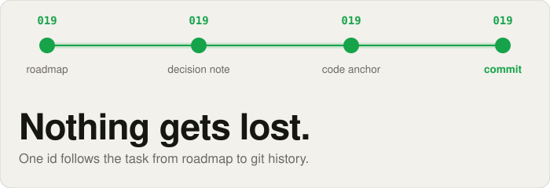

<div align="center">
  <picture>
    <source media="(prefers-color-scheme: dark)" srcset="assets/logo-dark.svg" />
    
  </picture>
  <h1>Foreman for Codex</h1>
  <p><strong>Your plan stays next to your code. The next task arrives with its context checked.</strong></p>
  
</div>

[Install](#install) · [What you can do](#what-you-can-do) · [What carries over](#what-carries-over) · [Codex integration](#codex-integration) · [Going deeper](#going-deeper)

Foreman keeps a correctable roadmap in your project, recommends the next useful
task, and crafts a prompt checked against the real files and symbols. Completed
work carries evidence back into the roadmap. Optional lessons let the next task
learn from the last one.

This is the **Codex-first port** of Foreman 2.6.0, developed on `codex/port`.
It preserves Foreman's workflow and existing data, using Codex's native skills,
hooks, and subagents where they fit. The original Claude Code release and
Foundry marketplace are separate; their install commands do not install this port.

## Install

Requirements: **Node.js 22 or later**, **Git**, and a Codex desktop or CLI host
with plugin support. Node must be available as `node` to the process running
hooks, or the Windows launcher must resolve the fnm-managed Node executable.
The hook adapter retains the Codex 0.145.0 command-hook baseline;
see [compatibility](CODEX.md) for exact coverage and validation limits.

Use Codex's built-in plugin creator with this local checkout:

```text
Use $plugin-creator to register this Foreman checkout in my personal
marketplace and install it for Codex. Preserve its .codex-plugin/plugin.json,
skills, hooks, scripts, assets, and prompt-template.md. Keep the original
Foundry marketplace and Claude Code Foreman installation unchanged.
```

Point it at the absolute path of this checkout. The plugin creator can place
a copy under your personal plugin directory and register the corresponding
marketplace entry. Review and enable its hooks in Codex, then start a **new
Codex task/session** to pick up the installed skills. This repository does not
silently edit your personal marketplace or Codex configuration.

Then ask **“Use Foreman to initialize this project.”** You can also select the
installed `init` skill in the skill picker. Skill names may be displayed with the
`foreman:` plugin namespace. Existing `ROADMAP.jsonl` and `.foreman/` data can be
reused without resetting them.

Local packaging and discovery follow the official
[plugin guide](https://developers.openai.com/plugins/build/plugins).

## What you can do

| You say… | Foreman does… |
| --- | --- |
| “Add this to the roadmap” | Records requested work, preserving its reason and boundaries |
| “Where are we?” | Shows status, blockers, work in flight, and items awaiting acceptance |
| “That task's description is out of date” | Corrects the entry with stale-read protection |
| “What's next?” | Ranks ready work and lets you choose a task and destination |
| “Check whether the plan still matches the code, then pick” | Surveys the code, presents grounded corrections, then selects work |
| “Is the roadmap file healthy?” | Runs structural checks without a codebase survey |
| “Craft a prompt for this” | Builds a checked handoff without requiring a roadmap entry |
| “Do this task in steps and wait for my approval between them” | Presents each meaningful result for Accept, Request changes, or Pause before continuing |

Foreman carries clear authorization forward. It asks about ambiguous scope and
unrequested proposals instead of asking you to approve the same request twice.
With the default verification setting, implementation waits in
`awaiting_acceptance` until you accept it.

Review between increments is an explicit choice for that run in this Codex
implementation. Each increment is one usable result, with automated
checks, human review, or both on the same row. When you request approval between
increments, every row includes human review and Foreman waits for your answer.
An ordinary split keeps its existing behavior. No new project setting or store
is required; final task acceptance remains separate. See the
[reviewed workflow and payload](HOW-IT-WORKS.md#review-between-increments) and
[installed-plugin usage](CODEX.md#use-reviewed-increments-after-installing).
You can also [evaluate from source](CODEX.md#evaluate-reviewed-increments-from-source)
without installing or publishing. Existing projects keep their roadmap and settings.

## What carries over

- **One local roadmap:** format 2 JSONL, stable IDs, dependency checks, deterministic
  task ranking, guarded corrections, archive/restore, and older-format migration
  with recovery backups.
- **Grounded prompts:** checked paths, symbols and verification commands; standard
  and reinforced profiles; purpose, boundaries, acceptance checks, decision
  context, previous task history, and optional presentation sections.
- **Your choice of destination:** run here as one unit, split by acceptance check,
  delegate to a background agent, or export/copy a prompt. Codex capabilities
  determine which actions are available; missing capabilities are explained.
- **Evidence and safe checkpoints:** exact task-owned staging, local checkpoint
  commits, `Foreman: <id>` trailers, planned versus observed file surfaces, and
  an explicit choice of what happens to a finished branch.
- **Continuity:** unfinished-work reminders, post-commit bookkeeping, optional
  decision/lesson recall and retirement, and opt-in local trial metrics.

The optional [ledger](ledger.md) remains off until requested. Disabling it does
not delete existing notes. Trial logging remains local and off by default.

## Codex integration

The five skills retain their responsibilities: `foreman` routes natural-language
requests; `init`, `roadmap`, `survey`, and `craft-prompt` perform the work.

Codex subagents replace Claude's agent/task APIs. Foreman uses bounded delegated
work with explicit ownership, waits for its result, and verifies it before
closing a roadmap entry. Model settings are inherited unless you choose an
override. A separate sidebar task is created only when you ask for one.

Codex has no `TaskCreated` or `TaskCompleted` hook events. Skills register a
selected entry explicitly and use a scoped `Stop` hook for the optional close
gate. Prompt export alone never marks work in progress. Hooks protect direct
patches to Foreman's data and provide lifecycle reminders; all authoritative
writes still go through the CLI.

Some integration details cannot be identical. Foreman does not invent a
context-fill percentage or claim it observes every file read through shell
code. [CODEX.md](CODEX.md) lists native replacements and remaining limitations.
Original demo assets and old benchmark records describe Claude runs, not
measured Codex performance.

## Going deeper

| Guide | Contents |
| --- | --- |
| [How it works](HOW-IT-WORKS.md) | Selection, execution, evidence and acceptance |
| [Codex compatibility](CODEX.md) | Runtime contracts, migration, validation and gaps |
| [Settings](settings.md) | Optional project configuration |
| [Roadmap schema](roadmap-schema.md) | Fields and CLI operations |
| [Ledger](ledger.md) | Lessons and decision references |
| [Prompt template](prompt-template.md) | Handoff structure and validation |
| [Reviewed-increment evidence](NANOTASKS-DOGFOOD.md) | Controlled Codex headless results and remaining acceptance limits |
| [Contributing](CONTRIBUTING.md) | Development and checks |

Foreman remains a tool for a solo developer. It does not become a team tracker,
code-review service, workflow server, or unattended scheduler. No account or
external storage is required. MIT — see [LICENSE](LICENSE).
