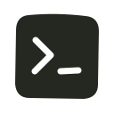
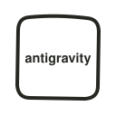
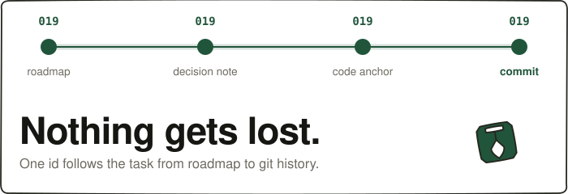

<div align="center">
  <picture>
    <source media="(prefers-color-scheme: dark)" srcset="assets/banner-dark.png" />
    
  </picture>
  <h1>Foreman</h1>
  <p><strong>Your plan stays next to your code. The next task arrives with its context checked.</strong></p>
</div>

<p align="center"><strong>Available on</strong></p>
<p align="center">
  <a href="#codex"></a>&emsp;&emsp;<a href="#claude-code"></a>&emsp;&emsp;<a href="#antigravity"></a><br />
  <a href="#codex">Codex</a>&emsp;&emsp;&emsp;&emsp;<a href="#claude-code">Claude</a>&emsp;&emsp;&emsp;<a href="#antigravity">Antigravity</a>
</p>

<p align="center"><a href="#install"><strong>Get started</strong></a> · <a href="#what-is-this">What is this?</a> · <a href="#how-it-works">How it works</a> · <a href="#what-you-can-do">What you can do</a> · <a href="#the-numbers">Evidence</a></p>

## What is this?

You finish a session with a fix, a side request and an issue still waiting. Next time, you need to know which one comes first and why. Foreman keeps that context in a roadmap beside your code.

Ask "what’s next?" and it recommends a task with its reason and a prompt checked against the project’s files. Completed work brings evidence back into the plan; acceptance stays a separate decision.

<p align="center"></p>

## Why you'd want it

- Pick up where the last session stopped.
- Keep the task, its reason and its constraints together.
- Check stale plans against the code before acting.
- Keep acceptance of finished work separate from a successful test run.

## How it works

The roadmap lives in your project. Foreman reads it, checks the relevant context and helps you choose what to do next. Optional lessons let later tasks learn from earlier work without creating a separate knowledge base.

## What you can do

| You want to | Outcome |
| --- | --- |
| Add work to the roadmap | Requested work recorded with its reason and boundaries |
| See where things stand | Status, blockers and work waiting for acceptance |
| Choose the next task | A recommended task and a choice of where to run it |
| Check whether the plan still matches the code | A grounded review before choosing work |
| Get a prompt for one-off work | A checked handoff without requiring a roadmap entry |

### How to ask

Plain sentences work in every assistant: "add this to the roadmap", "where are we?", "what's next?", "check whether the plan still matches the code" or "craft a prompt for this". If you would rather call Foreman by name, each assistant has its own way:

| You want to… | Claude Code | Codex | Antigravity |
| --- | --- | --- | --- |
| Ask in your own words | `/foreman:foreman` | the `foreman` skill | `/foreman` |
| Set up a roadmap for a project (once) | `/foreman:init` | the `init` skill | `/init` |
| Pick, add, correct or review work | `/foreman:roadmap` | the `roadmap` skill | `/roadmap` |
| Check the plan against your code | `/foreman:survey` | the `survey` skill | `/survey` |
| Write a one-off prompt with no roadmap entry | `/foreman:craft-prompt` | the `craft-prompt` skill | `/craft-prompt` |

## Install

Foreman is one plugin for the three assistants. Install it in the one you use; only the commands differ.

### Codex

Requirements: Node.js and Git (tested with Node.js 22), and a Codex host with plugin support.

```text
codex plugin marketplace add V-Songbird/foundry
codex plugin add foreman@foundry
```

Review and trust its hooks with `/hooks`, then start a new Codex session. Ask Foreman to initialize the project, or select its installed `init` skill.

### Claude Code

Requirements: Node.js and Git (tested with Node.js 22). In Claude Code, Foreman needs version 2.1.147 or later.

Inside Claude Code:

```text
/plugin marketplace add V-Songbird/foundry
/plugin install foreman@foundry
```

Start a new session to load the plugin. Run `/foreman:init` once in the project.

### Antigravity

Requirements: Node.js and Git (tested with Node.js 22), and the Antigravity CLI. Antigravity has no marketplace for third-party plugins, so install from a clone of the [foundry repository](https://github.com/V-Songbird/foundry). Its `foreman` folder is a submodule checked out at the commit Foundry pins for the current release. Clone it with its submodules, then install that folder. Replace `<path-to-foundry>` with the clone's directory:

```shell
git clone --recurse-submodules https://github.com/V-Songbird/foundry.git
agy plugin install "<path-to-foundry>/foreman"
agy plugin list
```

The list should name `foreman`. Start a new conversation to load the plugin, then run `/init` once in the project.

The install is a copy of that checkout. Install from the pinned commit, not from a clone of this repository, whose branches can hold unreleased work. To move to a newer release, update the clone, then replace the copy:

```shell
git -C "<path-to-foundry>" pull
git -C "<path-to-foundry>" submodule update --init foreman
agy plugin uninstall foreman
agy plugin install "<path-to-foundry>/foreman"
```

## Good to know

Foreman is for a solo developer. It does not become a team tracker, code-review service, unattended scheduler or workflow server. Your project keeps its own data. The optional ledger is off until requested; disabling it deletes no existing notes.

A lesson's verdict says whether its files changed since it was recorded, not whether the lesson was ever right, so a wrong lesson keeps being served until you retire it.

### Switching between assistants

Existing roadmap data can be reused. Every assistant reads and writes the same `ROADMAP.jsonl` and `.foreman/` files, so one project can move between them. Claude Code needs Foreman 2.7.0 or later to read entries that Codex wrote, and 3.2.0 or later for entries Antigravity wrote.

### Differences between hosts

Foreman does the same job in every assistant. The host — the assistant Foreman runs inside — decides which events and tools Foreman can use, so a few things work differently:

| | Claude Code | Codex | Antigravity |
| --- | --- | --- | --- |
| Starting a tracked task | A hook opens the roadmap entry when Foreman's prompt becomes a task | The prompt opens the entry with an explicit start command | The same explicit start command |
| Reminder when a task ends with its entry still open (`taskCloseGate`) | Once per task, the first attempt to finish is stopped with instructions to close the entry; the retry passes | After an explicit check finds the entry still open, Foreman asks Codex for one more turn | Not available: Antigravity has no task or stop event Foreman can use |
| Direct edits of the roadmap file are blocked for | `Edit` and `Write` | `apply_patch`, `Edit` and `Write` | `write_to_file`, `replace_file_content` and `multi_replace_file_content` |
| Lessons appear when a file is touched with | `Read`, `Edit` and `Write` | `apply_patch`, `Read`, `Edit` and `Write` | `view_file` and the three write tools, at the next model call |
| Offering untracked work Foreman noticed | After a commit | After a commit, in every handoff and before reporting completion | After a commit, at the next model call, in every handoff and before reporting completion |
| Advice based on how full the session is | When your auto-compact window is set ([settings](settings.md)) | Not available: Codex does not report it | Not available: Antigravity does not report it |
| Stopping for your approval after each result of a task | Not available in Claude Code yet | On explicit request | Not available |
| Model recorded when a task closes | Family name, such as `sonnet` | Exact model id | Exact model id |

On every host, a shell command can still write the roadmap file, and reading a file through the shell shows no lessons. A prompt copied out of one assistant carries that assistant's script paths, so craft it again in the other. [Foreman in Codex](CODEX.md) covers the Codex side in detail; an Antigravity session gets the same form of prompt, run with its own tools.

## The numbers

Each result belongs to the named model and recorded run. Measurements belong to the model and setup that produced them, so each host keeps its own table. Missing measurements remain marked as unmeasured.

### Codex results

<!-- foundry:evidence {"platform":"Codex","status":"pending","reason":"Functional Codex validation exists; equivalent paired performance measurements are not available."} -->
| Model | Setup | Correct tasks | Mean session cost |
| --- | --- | --- | --- |
| Not measured | Without plugin | Not measured | Not measured |
| Not measured | foreman | Not measured | Not measured |

Codex functional tests establish specific behaviors, not a speed, cost or correctness advantage over a baseline. Comparative performance remains unmeasured.

### Claude Code results

<!-- foundry:evidence {"platform":"Claude","status":"measured","models":["Claude Sonnet","Claude Opus"],"date":"2026-08-29"} -->
| Model | Setup | Correct tasks | Mean session cost |
| --- | --- | --- | --- |
| Claude Sonnet | Written task paragraph | 100% | $0.0757 |
| Claude Sonnet | Foreman | 100% | $0.0820 |
| Claude Opus | Written task paragraph | 100% | $0.1627 |
| Claude Opus | Foreman | 100% | $0.1746 |

Foreman tied the well-written paragraph on correctness and cost more: 8.3% on Sonnet and 7.3% on Opus. These are historical comparisons, not a claim about the current release or another model.

### Antigravity results

<!-- foundry:evidence {"platform":"Antigravity","status":"pending","reason":"No Antigravity performance measurements are available."} -->
| Model | Setup | Correct tasks | Mean session cost |
| --- | --- | --- | --- |
| Not measured | Not measured | Not measured | Not measured |

*Results can vary between runs.*

<!-- foundry:hero -->
<p align="center"></p>

The task trail above illustrates the workflow. The recorded demo below comes from Claude Code; it is not a Codex measurement.

<details>
<summary>Watch the recorded Claude Code demo</summary>

<p align="center"></p>

</details>
<!-- /foundry:hero -->

## Going deeper

[How it works](HOW-IT-WORKS.md) · [Settings](settings.md) · [Roadmap schema](roadmap-schema.md) · [Ledger](ledger.md) · [Foreman in Codex](CODEX.md) · [Codex handoff prompting](CODEX-PROMPTING.md)

[Product scope](docs/knowledge/scope.md) · [Incremental acceptance](docs/knowledge/incremental-acceptance.md) · [Changelog](docs/knowledge/changelog.md) · [Foundry](https://github.com/V-Songbird/foundry)

The benchmark instruments and research records behind the numbers are kept outside this repository and are not distributed with the plugin.

## License

MIT — see [LICENSE](LICENSE).
