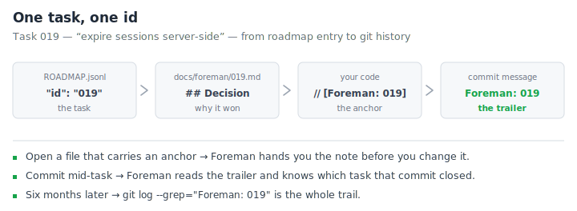

# Foreman — why-notes and the decision log

<!-- foreman:decision-log lastmod:2026-07-23 -->

Git remembers every diff. Nobody remembers *why*. Six months from now the
question isn't what changed — it's why anyone thought that was the right
call, and whether it's still true.

The decision log is Foreman's answer. Any task that makes a real call
writes a short note: the choice, the options that lost, what it commits
you to. One file per task, tagged into the code it governs. When someone
opens that code later, the note comes to them.

**It's off by default.** It writes files into your repo and comments into
your source, and that's not something to switch on behind your back. One
line in `.foreman/config.json` turns it on:

```json
{
  "decisionLog": {
    "enabled": true
  }
}
```

That's the whole active config. `dir` and `gate` fall back to their
defaults, so a project that's happy with `docs/foreman` and no close gate
never names them.

## One task, one id

Every roadmap task gets a three-digit id, and that id is the thread. It
starts in the roadmap, ends in your git history, and picks up the
reasoning on the way.

<p align="center"></p>

## Why your commits say `Foreman: 019`

That last box is the one people ask about.

A finished task closes in the *same* commit as the code it changed. The
roadmap file is written before the commit exists, so the entry can't
record a SHA that hasn't happened yet. The trailer points the link the
other way: the commit names the task. One commit, nothing dangling, no
second "update the roadmap" commit cluttering your history.

You'll see it whenever a tracked task finishes alongside code, whether or
not why-notes are on.

## What actually gets written

Closing task `019` with the log on produces two things.

**The note**, at `docs/foreman/019.md`:

```markdown
---
id: "019"
title: Expire sessions server-side
date: 2026-07-23
---

## Decision
...the choice, named, in one short paragraph.

## Context
...what forced a choice — the constraint or the conflict.

## Alternatives rejected
...one line each: the option, and the single reason it lost.

## Consequences
...what this commits future work to, including never-touch warnings.
```

**The anchor**, in the code that decision governs, in that file's own
comment syntax:

```js
// [Foreman: 019]
function expireSession(token) {
```

One site can carry several: `// [Foreman: 019, 034]`. Notes are dated
records and never edited backward — a reversal is a new note that names
the old one in its `supersedes` frontmatter.

Every close then records where its reasoning lives, or says outright that
there wasn't any: the entry gets `"doc": "docs/foreman/019.md"`, or
`"doc": "none"`.

## When Foreman reads it back

Three moments, none of which cost you a keystroke:

| Moment | What happens |
| --- | --- |
| You open a file carrying an anchor | The notes it names surface before you change what they govern — once per file per session |
| You commit while a task is open | The trailer says which task, so Foreman doesn't guess from filenames |
| You go digging months later | `git log --grep="Foreman: 019"` is the whole paper trail |

The first one keeps working even in a project that later turns authoring
off. Once an anchor exists in a codebase it stays findable.

## Settings

All under `decisionLog` in `.foreman/config.json`.

| Key | What it does |
| --- | --- |
| `enabled` | Whether tasks write notes and anchors at all. Default `false`. |
| `dir` | Where notes are written, relative to the project root. Default `docs/foreman`. |
| `gate` | `off` (default) lets a task close without recording a note. `block` holds the completion until it does. |

Spelled out in full, with every key set away from its default:

```json
{
  "decisionLog": {
    "enabled": true,
    "dir": "docs/decisions",
    "gate": "block"
  }
}
```

Two environment variables override the file, for a one-off run:
`FOREMAN_DECISION_LOG` accepts `1`, `true`, `0`, or `false`, and
`FOREMAN_DECISION_LOG_DIR` takes a relative path.

> [!NOTE]
> `gate: "block"` is worth thinking about before you set it. Refusing to
> close a task until it records a note is a good way to teach yourself to
> type `"none"` without reading the question — and a reflexive `"none"`
> is worse than an empty field, because it looks like a decision.

## Turning it off

Set `"enabled": false`, or drop the `decisionLog` block entirely. Nothing
new gets written. Notes and anchors already in the repo stay where they
are, and still surface when you open the files they tag — they're your
files now, not Foreman's state.
