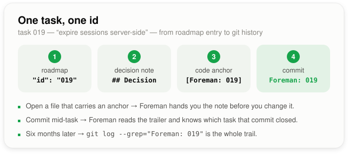

# Foreman — the ledger

<!-- foreman:ledger lastmod:2026-08-21 -->

Someone works on your login code. Along the way they find out the tests hang
unless you fake the clock. They fix their bug and finish.

That discovery is gone. It was never in the code. It was never in your saved
changes. It lived in one head for one afternoon, and three weeks later the
next person spends the same afternoon finding the same thing.

The ledger is where that sentence goes instead.

## What you do

One sentence, when a job is finished. That is the whole thing.

> token refresh lives in `session.js`, and tests have to fake the clock

Skipping it is normal. Most jobs teach nothing anyone else will need. The
sentence is worth writing only when it is something the next person would
need and could not easily work out alone.

## What you get back

You never have to go looking. The sentence comes to you, at the moment it
matters.

| When | What you see |
| --- | --- |
| A new job is written up | Anything recorded about the files that job will touch |
| You open a file | Anything recorded about that file |
| Six months later | Search your saved changes for the job number |

That first one is the point. The next job starts already knowing what the
last one found out, instead of working it out again.

## One job, one number

Every job gets a number, and the same number turns up in four places. Once
you spot the pattern the whole thing reads as one piece.

<p align="center"></p>

That last one is the box people ask about. A finished job is saved together
with the code it changed, and the job list is written first — so it cannot
name a saved change that does not exist yet. The line points the other way
instead: the saved change names the job.

You get that one line whether or not the ledger is on. Nothing else about
what you write is touched.

## Marking code

Put a comment like this next to code that some job settled:

```js
// [Foreman: 019]
```

It is an ordinary comment in your own file. One spot can carry a few:
`// [Foreman: 019, 034]`.

From then on, anyone handed work on that file is told which job governs it,
by name. If you keep a written decision at `docs/foreman/019.md`, they are
pointed at that too.

Foreman never writes those documents. Where you write your decisions down,
and what they look like, is yours.

## Nothing arrives without an age

A recorded sentence is a claim about code, and code moves. A three-month-old
claim served as fact is worse than no claim at all, because it sounds sure of
itself.

So every sentence you are shown is checked first, and comes with a verdict:
**unchanged since**, **may be out of date**, or **cannot tell**. A sentence
about files that no longer exist is dropped rather than shown. And when
Foreman cannot tell, you get the file names only — never a claim it could
not check.

## When one turns out to be wrong

Retire it. It stops being quoted and stops taking up room. Foreman's own
roadmap review retires anything its evidence contradicts, and you can retire
one yourself at any time.

Retiring does not rewrite history. The line stays, marked as retired.

## Turning it on

It is off until you say yes, because switching it on puts a new file in your
project.

```json
{
  "ledger": {
    "enabled": true
  }
}
```

That goes in `.foreman/config.json`. You will probably never type it —
Foreman asks the question itself, once, the first time it could pay off: when
a new job is about to touch files a finished job already worked on. Saying no
is remembered too, which is what stops it asking again.

## What it will never do

- Change your saved-change messages, beyond that one `Foreman: 019` line.
- Write documents for you, or hand you a template to fill in.
- Stop you finishing a job because you skipped the sentence.
- Delete anything if you switch it back off. What was recorded stays.

> [!NOTE]
> If your project already has `decisionLog` or `areaNotes` in its settings,
> leave them. Both still work and both mean the ledger. The old
> `decisionLog.gate` switch no longer does anything.
